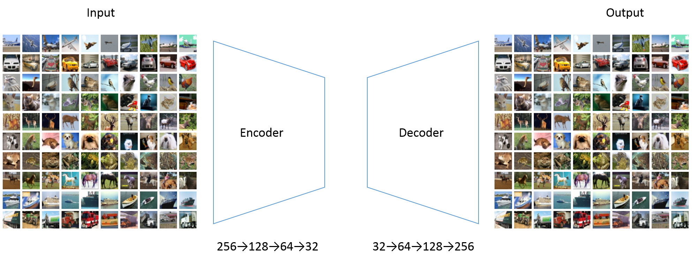
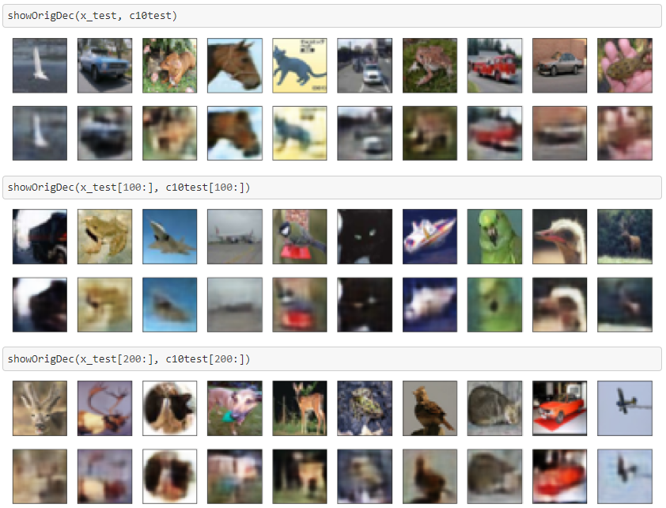
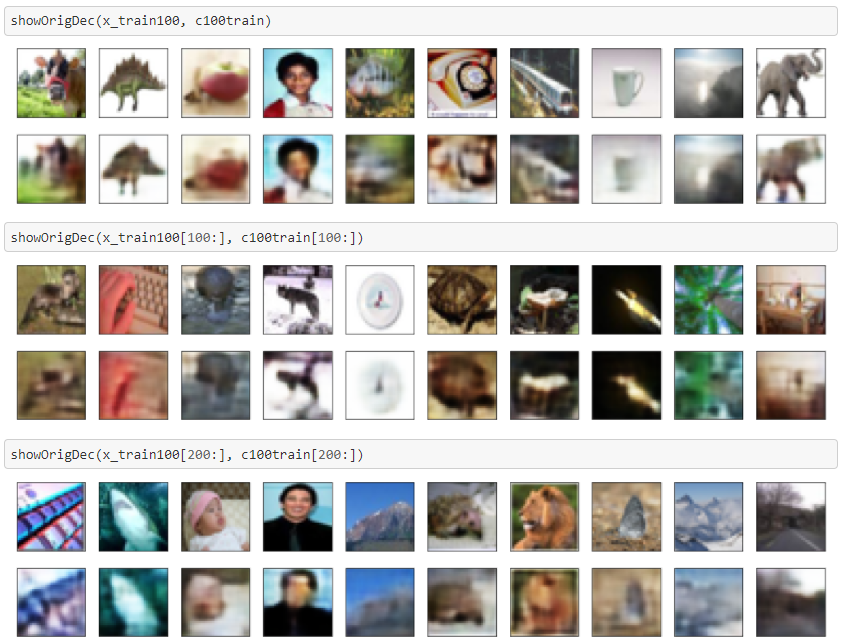
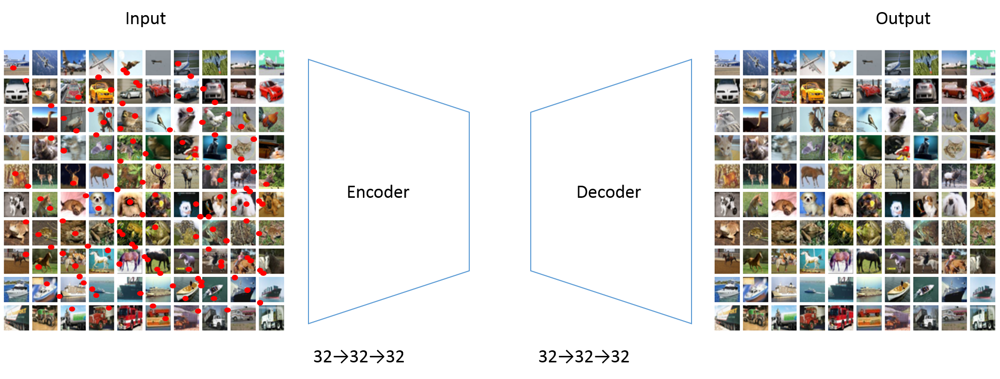
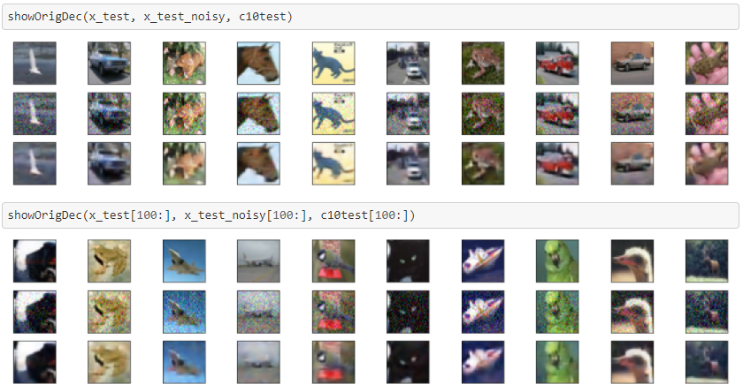
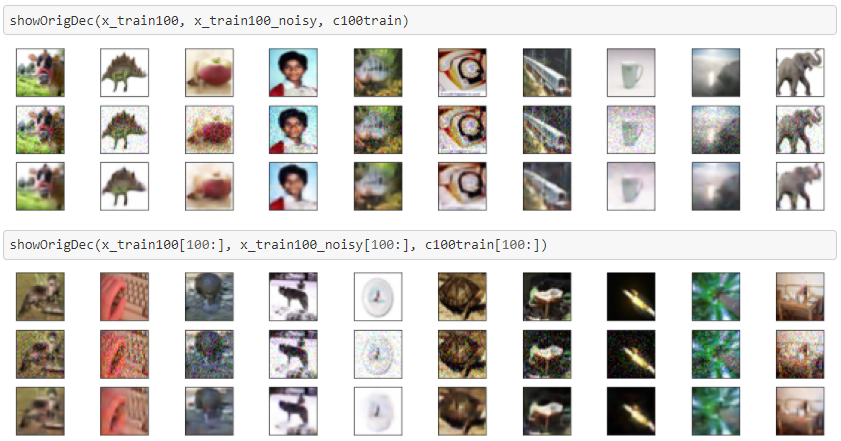
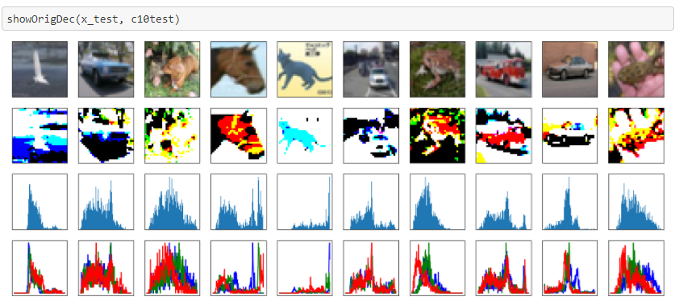
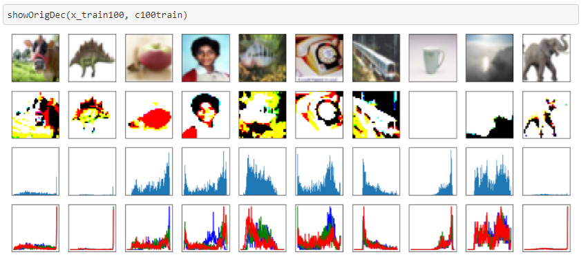
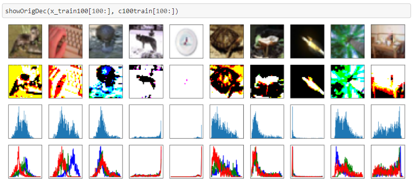

# Keras_Autoencoder
The repository provides a series of convolutional autoencoder for image data from Cifar10 using Keras.

## 1. convolutional autoencoder
The [convolutional autoencoder](./Cifar_Conv_AutoEncoder.ipynb) is a set of encoder, consists of convolutional, maxpooling and batchnormalization layers, and decoder, consists of convolutional, upsampling and batchnormalization layers. The goal of convolutional autoencoder is to extract feature from the image, with measurement of binary crossentropy between input and output image

#### Architecture

#### input and output
You can see there are some blurrings in the output images.

## 2. denoising convolutional autoencoder
Let's try image denoising using .
Noises are added randomly. The input image is noisy ones and the output, the target image, is the clear original one. The autoencoder is trained to denoise the images.

#### Architecture

#### input and output
You can see there are some blurrings in the output images, but the noises are clear.

## 3. UNET
[UNET](./Cifar_Conv_AutoEncoder_UNET.ipynb) is an U shaped neural network with concatenating from previous layer to responsive later layer, to get segmentation image of the input image.
https://arxiv.org/abs/1505.04597

#### Architecture

#### input and output
These are the original input image and segmented output image.
The two graphs beneath images are grayscale histogram and RGB histogram of original input image. As you can see, the histograms with high peak mountain, representing object in the image (or, background in the image), gives clear segmentation, compared to non-peak histogram images.

#### Refence
https://blog.keras.io/building-autoencoders-in-keras.html
